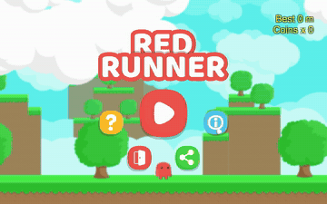
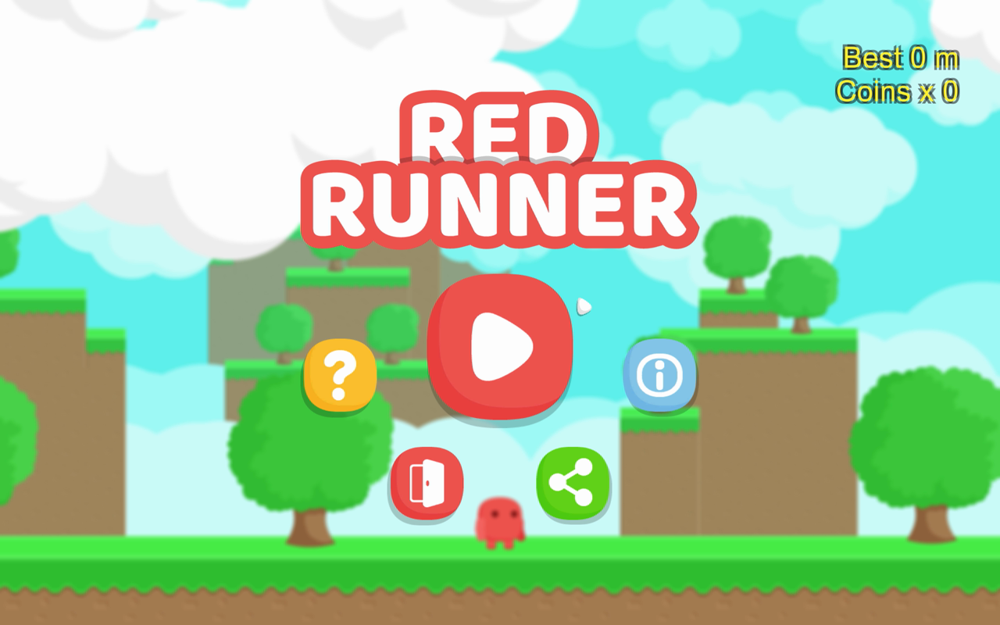
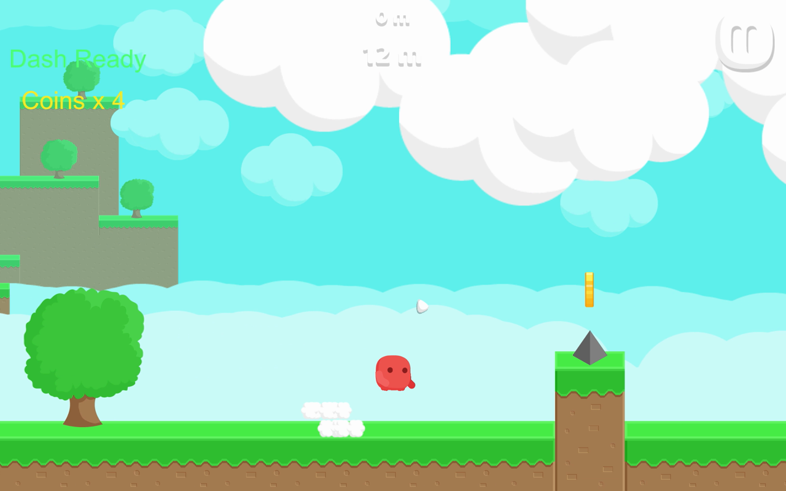
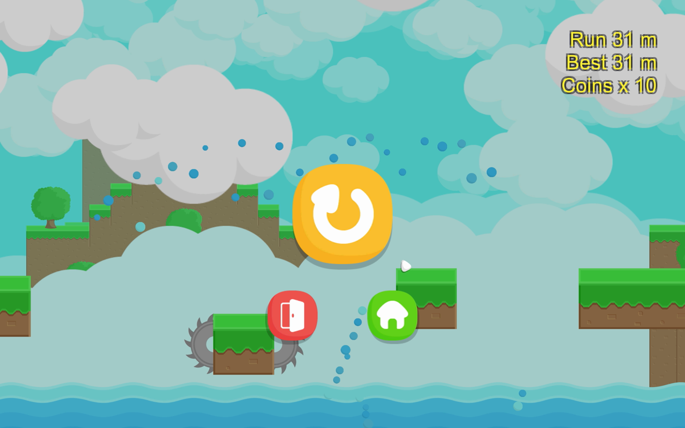

# RedRunner Portfolio



这是一个基于开源项目 [BayatGames/RedRunner](https://github.com/BayatGames/RedRunner) 二次开发的 Unity 2D 平台跑酷作品集项目。

本项目的目标不是简单复制原项目，而是在跑通原版游戏的基础上，逐步完成角色控制、玩法系统、UI 反馈、本地数据保存、对象池状态修复和项目文档整理，使其成为游戏客户端应届生求职时可以展示和讲解的 Demo。

## 项目定位

- 类型：Unity 2D 平台跑酷游戏
- 引擎版本：Unity 6000.2.6f2
- 主要语言：C#
- 适用方向：Unity 游戏客户端开发、Gameplay 程序、客户端工程实习/校招作品集

## 已完成改造

### 玩法与手感

- 新增 Dash 冲刺技能，支持左 Shift 触发
- 为 Dash 增加冷却时间、冷却 UI、粒子特效和冲刺音效
- 新增二段跳能力
- 新增 Coyote Time，让角色刚离开平台后仍可短时间起跳
- 新增 Jump Buffer，让玩家快落地前提前按跳也能自动触发
- 新增动态难度速度成长，角色会随奔跑距离逐步加速
- 新增 Speed Up 等级提示，让速度成长更容易被玩家感知

### UI 与反馈

- 新增游戏内金币数量显示
- 新增 Dash Ready / Dash 冷却倒计时显示
- 新增开始页与结束页数据展示，包括最高分、上一局距离、金币数
- 新增成就/里程碑提示，例如首次金币、金币收集数量、奔跑距离
- 新增操作提示 UI，降低试玩者上手成本
- 新增 R 键快速重开流程，并复用原有 UI 重开逻辑

### 数据与工程

- 新增本地金币、最高分、上一局分数、声音设置保存
- 新增暂停界面清除本地存档按钮
- 修复金币收集时对象池为空导致的 NullReferenceException
- 优化对象池复用状态，金币重新生成时会恢复显示、碰撞、动画、粒子和刚体状态
- 更新项目结构说明文档，记录核心模块、改造内容和面试讲法

## 演示截图

| 开始页 | 游戏内 | 结算页 |
| --- | --- | --- |
|  |  |  |

## 操作说明

| 操作 | 按键 |
| --- | --- |
| 左右移动 | A / D |
| 跳跃 / 二段跳 | Space |
| Dash 冲刺 | Left Shift |
| 暂停 | Esc |
| 快速重开 | R |

## 核心技术点

### 角色控制

角色移动、跳跃、二段跳和 Dash 都集中在 `RedCharacter.cs` 中。角色不是直接修改坐标移动，而是通过 `Rigidbody2D.linearVelocity` 控制运动，更符合 Unity 2D 物理项目的常见写法。

### 输入容错

Coyote Time 和 Jump Buffer 用于提升平台跳跃手感：

- Coyote Time 解决“刚走出平台边缘就不能跳”的问题
- Jump Buffer 解决“快落地前提前按跳却没响应”的问题

这类功能体现的是游戏客户端对玩家输入体验的处理能力。

### UI 状态同步

金币、最高分、Dash 冷却、成就提示等 UI 会跟随游戏状态刷新。部分 UI 使用运行时创建方式，减少手动改场景带来的维护成本。

### 本地数据保存

项目使用 PlayerPrefs 保存金币数量、最高分、上一局分数和声音设置，并提供清除本地数据入口，形成完整的数据读写闭环。

### 对象池复用

对象池复用金币时，通过 `OnSpawnFromPool()` 重置对象状态，避免金币被回收后保留隐藏、无碰撞、动画残留等旧状态。

## 项目结构

```text
Assets/Scripts/RedRunner
├── Characters          # 角色控制、跳跃、Dash、死亡逻辑
├── Collectables        # 金币、宝箱、可收集物逻辑
├── ObjectPool          # 对象池
├── TerrainGeneration   # 跑酷地形生成
├── UI                  # UI 界面、文本、提示和数据展示
├── AudioControl        # 音效管理
└── Utilities           # 通用工具类
```

详细说明见：[`Docs/architecture.md`](Docs/architecture.md)

面试讲解稿见：[Docs/interview-notes.md](Docs/interview-notes.md)

## 如何运行

1. 安装 Unity Hub
2. 安装 Unity 6000.2.6f2
3. 使用 Unity Hub 打开本项目根目录
4. 打开 `Assets/Scenes/Play.unity`
5. 点击 Play 运行游戏

## 面试时可以重点讲

- 我基于一个已有 Unity 开源项目做二次开发，而不是从空项目堆功能
- 我先跑通项目并阅读核心结构，再逐步加功能和修复问题
- 我新增 Dash、二段跳、跳跃容错、动态难度等 Gameplay 功能
- 我补充了 UI 反馈、本地保存和成就提示，让功能可被玩家感知
- 我修复了对象池和空引用问题，体现了对运行时稳定性的关注
- 我持续维护 `Docs/architecture.md`，说明自己能做工程记录和项目复盘

## 后续计划

- [x] 增加正式截图和 GIF 演示
- [x] 构建 Windows 可运行版本
- [ ] 部署 WebGL 在线试玩版本（GitHub Pages）
- 增加简单的新手引导或关卡节奏说明
- 继续整理简历项目描述和面试问答

## 原项目与 License

本项目基于 Bayat Games 的 RedRunner 开源项目进行学习型二次开发。

- 原项目地址：[BayatGames/RedRunner](https://github.com/BayatGames/RedRunner)
- 原项目 License：MIT
- 原项目作者：Bayat Games

本仓库保留原项目版权与 License 信息，二次开发内容用于个人学习与求职作品集展示。

